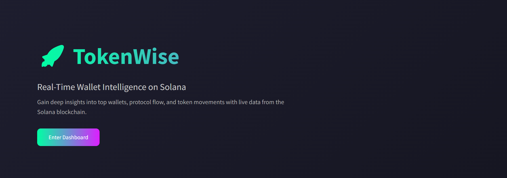
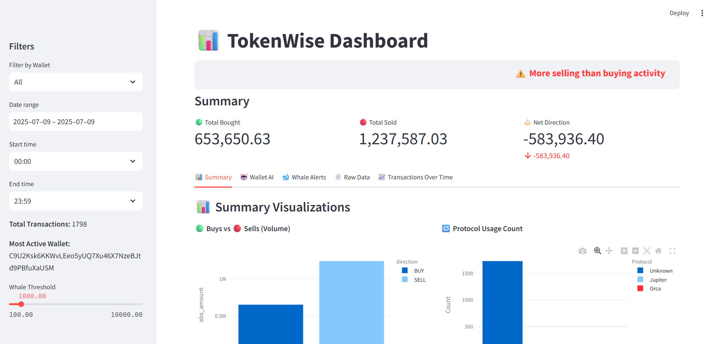
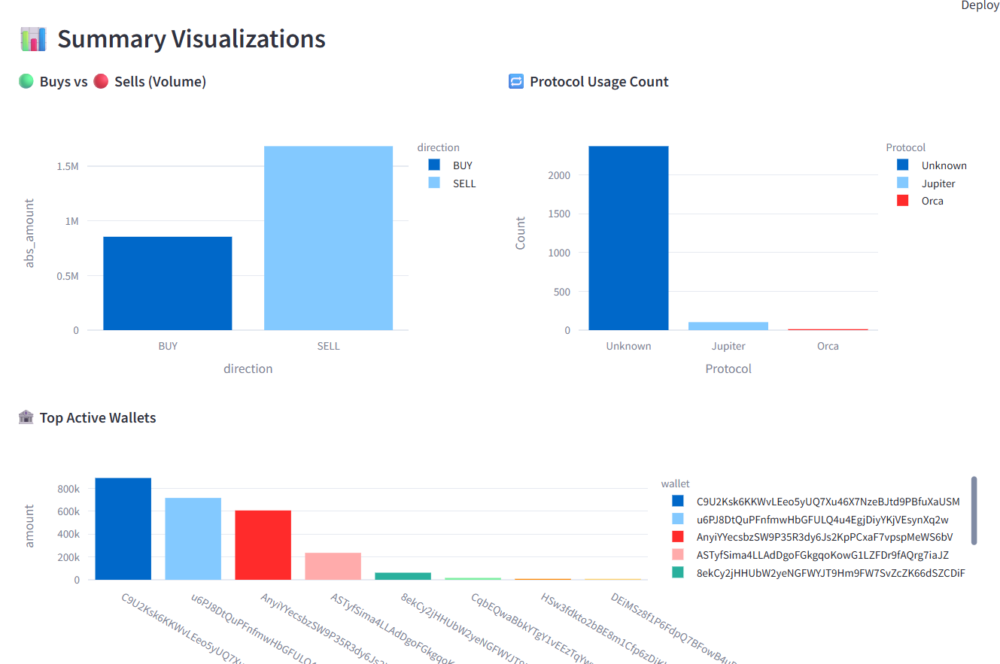

# TokenWise : Real-time-Solana-Wallet-Intelligence-Platform
TokenWise is a **real-time wallet intelligence dashboard** for Solana tokens.  
It tracks the **top 60 wallets** of any SPL token, receives live transaction updates via Helius webhooks, stores the data locally, and visualizes it in a **Streamlit dashboard** with animations and AI-powered anomaly detection.

## Features
- Fetch **top 60 token holders** via Helius RPC.
- Real-time **transaction monitoring** using Ngrok + Flask webhook.
- **Protocol inference** (Jupiter, Raydium, Orca or unknown ).
- **AI-based anomaly detection** using Isolation Forest.
- Beautiful, interactive **Streamlit dashboard** with Lottie animations.
- Fully runnable inside **Jupyter Notebooks**.

## Workflow
1. **Fetch Top Wallets**  
   Use `Fetching_60+WebhookReg` to call Helius RPC and save the top 60 holders to `data/top_wallets.txt`.

2. **Ngrok Setup**  
   Use `ngrok_auth_and_url.ipynb` to authenticate Ngrok and get a public webhook URL.

3. **Register Webhook**  
   Use `Fetching_60+WebhookReg` to register the public URL and top wallet list with Helius.

5. **Run Flask Server**  
   Use `flask_webhook_server.ipynb` to receive and process transactions in real time.

6. **View Dashboard**  
   Use `streamlit_dashboard.ipynb` to launch the dashboard and explore token activity.

## Screenshots
### Landing Page

*Landing page with animated intro and "Enter Dashboard" button*

### Dashboard

*Interactive dashboard showing live Solana wallet insights,AI anomaly detection,Whale alerts,Filters,Raw data,Transaction over time graph*

### Summary_tab

*Real time analytics*

